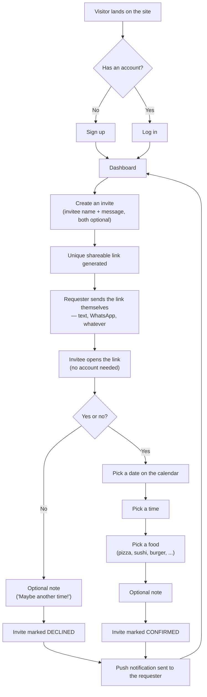
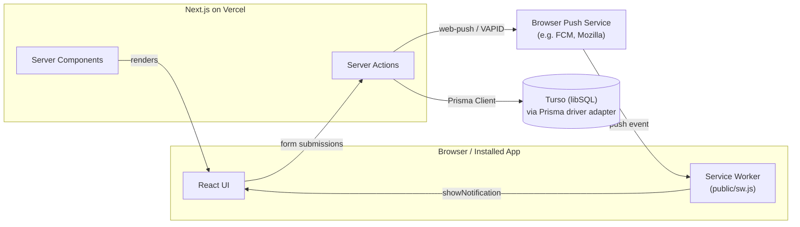

# Ask Them Out 💘

A tiny app for asking someone on a date without the back-and-forth. Create an account, generate
a link, send it to the person you want to ask. They open it, say yes or no, and if it's a yes
they pick the date, time, and food — no account required on their end.

It's built as an installable web app (PWA) that can also be wrapped as a native Android app for
the Google Play Store.

---

## Table of contents

- [How it works](#how-it-works)
- [Architecture](#architecture)
- [Features](#features)
- [Tech stack](#tech-stack)
- [Project structure](#project-structure)
- [Data model](#data-model)
- [Requirements](#requirements)
- [Environment variables](#environment-variables)
- [Getting started](#getting-started)
- [Database workflow](#database-workflow)
- [Push notifications setup](#push-notifications-setup)
- [Deploying to production](#deploying-to-production)
- [Mobile app (Android / Play Store)](#mobile-app-android--play-store)
- [Known limitations](#known-limitations)

---

## How it works



The invitee never creates an account — the invite link itself (an unguessable token) is their
access. Revisiting an already-answered link shows the same result instead of erroring, so it's
safe to click twice.

## Architecture



Everything runs through Next.js's App Router: pages are React Server Components that read
straight from the database, and all writes (signup, login, creating an invite, responding to
one) go through Server Actions — there's no separate REST/JSON API layer.

## Features

- Email/password accounts for the person sending invites (the **Requester**)
- One-click shareable invite links — no account needed for the person receiving one (the
  **Invitee**)
- Multi-step invite response: yes/no → date (custom calendar) → time → food → optional note
- Dashboard showing every invite's status (waiting / confirmed / declined) with the invitee's
  response details
- Web Push notifications: a welcome push once enabled, and a push whenever someone responds to
  an invite
- Installable as a PWA (manifest + service worker + app icons), wrappable as a TWA for the Play
  Store
- A dedicated `/privacy` page (required for Play Store submission)

## Tech stack

| Layer | Choice | Why |
|---|---|---|
| Framework | [Next.js 16](https://nextjs.org) (App Router) | Server Components + Server Actions mean no separate backend/API layer — pages fetch data directly and forms call typed server functions. |
| Language | TypeScript | Type safety across the server actions, Prisma models, and React components. |
| UI | React 19 | Ships with Next.js 16; used with Server Components by default and `"use client"` only where interactivity is needed. |
| Styling | [Tailwind CSS v4](https://tailwindcss.com) | Utility-first CSS, no separate stylesheet files to maintain; the whole pink→orange gradient theme lives in class names. |
| Fonts | [Fredoka](https://fonts.google.com/specimen/Fredoka) (headings) + [Plus Jakarta Sans](https://fonts.google.com/specimen/Plus+Jakarta+Sans) (body) | Loaded via `next/font/google`, self-hosted at build time (no runtime request to Google Fonts). |
| Database ORM | [Prisma 7](https://www.prisma.io) | Generates a fully-typed client from `prisma/schema.prisma`. Prisma 7 dropped the old Rust query-engine binary in favor of a WASM query compiler + JS driver adapters. |
| Database driver | [`@prisma/adapter-libsql`](https://www.npmjs.com/package/@prisma/adapter-libsql) + [`@libsql/client`](https://www.npmjs.com/package/@libsql/client) | Talks to SQLite over the libSQL protocol — works identically against a local file (dev) or a remote [Turso](https://turso.tech) database (production). |
| Database | SQLite (dev) / Turso (prod) | Zero-ops database; Turso gives you a hosted, globally-replicated SQLite that Vercel's serverless functions can reach over HTTP. |
| Auth | [`bcryptjs`](https://www.npmjs.com/package/bcryptjs) + [`jose`](https://www.npmjs.com/package/jose) | `bcryptjs` hashes passwords (pure JS, no native build step — important for serverless). `jose` signs a JWT stored in an httpOnly session cookie; no external auth provider. |
| Validation | [`zod`](https://zod.dev) | Validates signup/login form input server-side before it touches the database. |
| Calendar | [`react-day-picker`](https://daypicker.dev) (+ `date-fns`) | The same library shadcn/ui's Calendar component wraps; fully restyled here to match the app's own gradient theme via a custom `DayButton` component. |
| Push notifications | [`web-push`](https://www.npmjs.com/package/web-push) | Signs and sends Web Push messages using VAPID keys; pairs with the browser's native `PushManager` API on the client and a service worker to display them. |
| PWA | Next.js `app/manifest.ts` + `public/sw.js` | Makes the site installable (Android "Add to Home Screen", TWA-eligible) with a real app icon, theme color, and offline-tolerant service worker. |
| Mobile packaging | [Bubblewrap](https://github.com/GoogleChromeLabs/bubblewrap) (TWA) | Wraps the *deployed* PWA in a thin native Android shell for the Play Store — no separate mobile codebase. |
| Hosting | [Vercel](https://vercel.com) | Zero-config Next.js deploys, environment variables, automatic redeploys on push. |

## Project structure

```
src/
  app/
    actions/
      auth.ts              Server actions: signupAction, loginAction, logoutAction
      push.ts               Server action: subscribeToPushAction (saves a push subscription)
    dashboard/
      page.tsx              Requester's dashboard (Server Component)
      actions.ts             Server action: createInviteAction
    invite/[token]/
      page.tsx               Public invite page (Server Component, fetches by token)
      InviteFlow.tsx          Client component: the yes/no → date → time → food wizard
      actions.ts              Server actions: declineInviteAction, confirmInviteAction
    login/, signup/           Auth forms (client components using useActionState)
    privacy/                  Privacy policy page (required for Play Store)
    layout.tsx                 Root layout: fonts, metadata, service worker registration
    manifest.ts                 PWA manifest (served at /manifest.webmanifest)
    page.tsx                     Landing page
  components/
    Calendar.tsx               Themed react-day-picker wrapper
    NotificationSetup.tsx      "Enable notifications" button + push subscription logic
    ServiceWorkerRegistration.tsx  Registers public/sw.js on mount
    Stickers.tsx                Decorative floating-emoji background component
    SubmitButton.tsx             Form submit button with pending state (useFormStatus)
    CopyLinkButton.tsx           Copy-to-clipboard button for invite links
  lib/
    prisma.ts                   Prisma Client singleton, wired to the libSQL driver adapter
    session.ts                   JWT session cookie helpers (create/destroy/read)
    auth.ts                       Password hashing (bcryptjs)
    require-user.ts                Server-side "redirect to /login if not authed" helper
    push.ts                         sendPushToUser() — signs and sends a Web Push message
    token.ts                         Generates unguessable invite tokens
    food-options.ts                  The list of selectable foods (pizza, sushi, ...)
  generated/prisma/                 Prisma's generated client (gitignored, regenerated on install)
prisma/
  schema.prisma                     Data model
  migrations/                       SQL migration history
public/
  sw.js                              Service worker (install/activate/fetch/push/notificationclick)
  icon-192.png, icon-512.png,
  icon-512-maskable.png              App icons referenced by the manifest
next.config.ts                       serverExternalPackages config (see below)
prisma.config.ts                     Prisma CLI config (datasource URL for migrate/generate)
```

## Data model

Three tables, defined in [`prisma/schema.prisma`](prisma/schema.prisma):

- **`User`** — a Requester's account (email, hashed password, name).
- **`Invite`** — one shareable link. Holds the invitee's name/message (set by the Requester), its
  `status` (`PENDING` / `DECLINED` / `CONFIRMED`), and — once answered — the chosen date, time,
  food, and the invitee's optional response note.
- **`PushSubscription`** — a browser's Web Push subscription (endpoint + keys), linked to the
  `User` who enabled notifications. A user can have several (one per device/browser).

## Requirements

- **Node.js 20.19+, 22.12+, or 24+** — Prisma 7 refuses to install on anything older.
- npm (ships with Node)
- Accounts, only if you plan to deploy:
  - [Turso](https://turso.tech) — production database
  - [Vercel](https://vercel.com) — hosting
  - A Google Play Console developer account — only if you want it on the Play Store

## Environment variables

All read from `.env` locally, or from your hosting provider's environment variable settings in
production. See `.env` in this repo for a working local-dev example.

| Variable | Required | Purpose |
|---|---|---|
| `DATABASE_URL` | Local dev only | SQLite file path, e.g. `file:./dev.db`. Ignored if `TURSO_DATABASE_URL` is set. |
| `TURSO_DATABASE_URL` | Production | Your Turso database's `libsql://...` connection URL. |
| `TURSO_AUTH_TOKEN` | Production | Auth token for that Turso database (`turso db tokens create <db>`). |
| `AUTH_SECRET` | Always | Random secret used to sign session-cookie JWTs. Generate with `node -e "console.log(require('crypto').randomBytes(32).toString('hex'))"`. |
| `BASE_URL` | Always | The site's own base URL, used server-side to build shareable invite links (e.g. `http://localhost:3100` locally, `https://yourapp.vercel.app` in prod). Deliberately **not** `NEXT_PUBLIC_*` — it's never read in the browser. |
| `NEXT_PUBLIC_VAPID_PUBLIC_KEY` | For push notifications | Public VAPID key — safe to expose to the browser by design (that's how Web Push works). |
| `VAPID_PRIVATE_KEY` | For push notifications | Private VAPID key — keep secret. |
| `VAPID_SUBJECT` | For push notifications | A `mailto:` or `https:` URL identifying you to push services, e.g. `mailto:you@example.com`. |

Generate a VAPID key pair with `npx web-push generate-vapid-keys`. If these three are missing,
push notifications silently no-op instead of crashing the app (see `src/lib/push.ts`).

## Getting started

```bash
git clone https://github.com/amino95/dating_app.git
cd dating_app
npm install                  # also runs `prisma generate` via postinstall
```

Create a `.env` file (see [Environment variables](#environment-variables) above; at minimum you
need `DATABASE_URL` and `AUTH_SECRET`):

```bash
DATABASE_URL="file:./dev.db"
AUTH_SECRET="<random hex string>"
BASE_URL="http://localhost:3100"
```

Apply the database schema, then start the dev server:

```bash
npx prisma migrate dev
npm run dev
```

Open **http://localhost:3100**.

## Database workflow

- **Change the schema**: edit `prisma/schema.prisma`, then run `npx prisma migrate dev --name <description>`. This creates a migration file, applies it to your local `dev.db`, and regenerates the Prisma Client.
- **Apply existing migrations** (e.g. after pulling changes): `npx prisma migrate deploy`.
- **Apply migrations to Turso in production**: Turso is genuinely just SQLite, so you run the generated `.sql` file straight through the Turso CLI:
  ```bash
  turso db shell <your-db-name> < prisma/migrations/<migration-folder>/migration.sql
  ```
- **Inspect data locally**: `npx prisma studio` opens a GUI against your local `dev.db`.

## Push notifications setup

1. Generate keys: `npx web-push generate-vapid-keys`.
2. Set `NEXT_PUBLIC_VAPID_PUBLIC_KEY`, `VAPID_PRIVATE_KEY`, and `VAPID_SUBJECT` (see table above).
3. On the dashboard, click **"Enable notifications for responses"** — this requests browser
   permission, subscribes via the service worker's `PushManager`, saves the subscription
   (`subscribeToPushAction`), and immediately sends a welcome push to confirm it's working.
4. From then on, `declineInviteAction` and `confirmInviteAction` (in
   `src/app/invite/[token]/actions.ts`) call `sendPushToUser()` whenever an invite gets a
   response, notifying every subscribed device for that Requester.

Push only works over HTTPS (or `localhost`) and needs a real browser push service to reach —
it can't be fully exercised from an automated test environment, only on a real deployed URL.

## Deploying to production

1. **Turso**: `turso db create <name>`, then grab the URL (`turso db show <name> --url`) and a
   token (`turso db tokens create <name>`).
2. **Vercel**: import the repo, set the environment variables from the table above
   (`TURSO_DATABASE_URL`, `TURSO_AUTH_TOKEN`, `AUTH_SECRET`, `BASE_URL`, and the three `VAPID_*`
   ones if you want push notifications), deploy.
3. **Apply the schema to Turso** using the `turso db shell ... < migration.sql` command above,
   for every migration folder in order.
4. `next.config.ts` sets `serverExternalPackages: ["@prisma/client", "@prisma/adapter-libsql",
   "@libsql/client"]` — this stops Next.js from bundling Prisma's generated client and the libSQL
   driver, both of which rely on dynamic WASM loading that breaks under bundling. This is a known
   Prisma 7 + Next.js + Vercel gotcha; without it, database queries can fail in production even
   though everything works locally.

## Mobile app (Android / Play Store)

The app is already a valid installable PWA (`src/app/manifest.ts`, `public/sw.js`, app icons), so
getting it onto the Play Store is a wrapping step, not a rewrite:

1. Deploy the app to a real HTTPS URL (see above).
2. `npm i -g @bubblewrap/cli`, then `bubblewrap init --manifest https://yourapp.com/manifest.webmanifest` — this generates an Android project and a signing key. **Back up that keystore** — you need it for every future update.
3. `bubblewrap build` produces `app-release-bundle.aab` for Play Store upload.
4. Add a `public/.well-known/assetlinks.json` file with your Android package name and the
   signing certificate's SHA-256 fingerprint (Bubblewrap prints it), so the app opens without a
   browser address bar. Redeploy.
5. Create a Google Play Console app, upload the `.aab`, and use `https://yourapp.com/privacy` as
   the required Privacy Policy URL — fill in a real contact email in `src/app/privacy/page.tsx`
   before submitting.

## Known limitations

- No email verification or password reset flow — signup is instant, and a forgotten password
  currently means creating a new account.
- No realtime updates — the dashboard reflects an invite's status as of the last page load/reload,
  not live via websockets.
- Push notification delivery can't be verified in an automated/local environment — it depends on
  a real browser's connection to a push service (FCM, etc.), so only manual testing on a deployed
  URL confirms it end-to-end.
- Invite links are unguessable but not authenticated — anyone with the link can view and respond
  to it, which is the intended trust model for a "send this to one specific person" flow.
